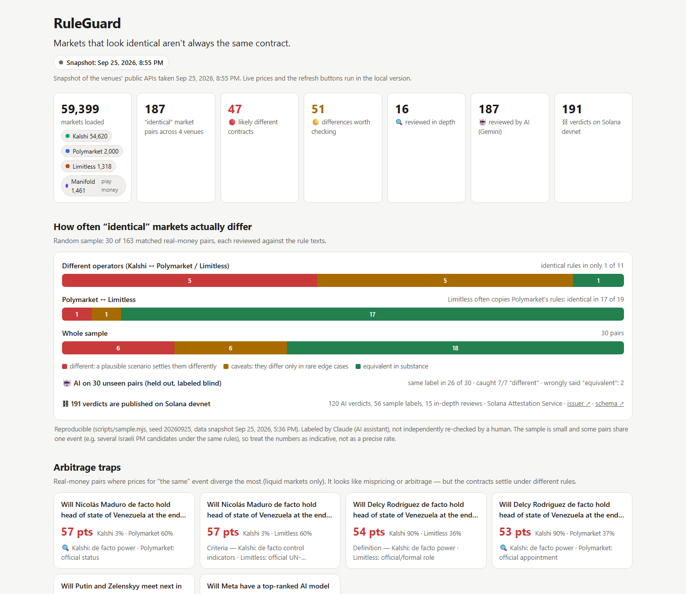

# RuleGuard — rule-equivalence layer for prediction markets

[](https://github.com/aldikbobr/ruleguard/actions/workflows/ci.yml)
[](LICENSE)
[](https://explorer.solana.com/address/92cf2ssEpn7KbqrgFj6PWKouiDwbW276Fk7s1WUwMy9t?cluster=devnet)
[](https://colosseum.com/worldsfair)

> Markets that look identical on Kalshi, Polymarket, Limitless and Manifold often settle under different rules. RuleGuard matches "the same" market across venues, compares the resolution rules clause by clause, and publishes a verdict for every pair on Solana, so traders, aggregators and bots stop mistaking a rule gap for arbitrage.

[Live demo](https://aldikbobr.github.io/ruleguard/) · [Pitch deck](https://aldikbobr.github.io/ruleguard-deck/) · [Findings](research/FINDINGS.md) · [Docs](docs/) · Video walkthrough (coming soon)

---



---

## Team

| Name | Role | Contact |
|------|------|---------|
| [Name] | [Role] | [Telegram / X] |
| [Name] | [Role] | [Telegram / X] |

---

## Problem and Solution

### 1. Same title, different contract
- **Problem:** "Venezuela's head of state at the end of 2026" is listed on both Kalshi and Polymarket. Kalshi resolves on who holds power **de facto**; Polymarket resolves on who is **officially** appointed and sworn in. On Sep 25, 2026 Kalshi priced Delcy Rodríguez at 91¢ and Polymarket at 37¢. Nothing was mispriced: they are two different questions.
- **RuleGuard:** reads both rule texts, lines up each settlement term (event, threshold, deadline, window, source, exclusions, fallback) and flags the pair as `different` with the scenario in which the two settle apart.

### 2. Scanners rank rule gaps as the best trades
- **Problem:** in our first scan, all five of the largest Kalshi–Polymarket spreads were different contracts (de facto vs official, "any time before 2027" vs one moment on Sep 30, a 2028 vs 2026 deadline). A spread scanner puts exactly these rows at the top.
- **RuleGuard:** shows a verdict and a divergence scenario next to every price gap, and ranks "arbitrage traps" by the mid-price gap on liquid markets only, because raw spreads in thin books move within minutes.

### 3. A "risk-free" hedge can lose on both legs
- **Problem:** a trader hedged a player prop across Kalshi and Polymarket for +$3 and lost $47 when the player didn't play: one venue settled No, the other at the last traded price ([DarkHorse Odds, Sep 22, 2026](https://about.darkhorseodds.com/guides/kalshi-polymarket-market-rules)). A live case this week: "Bitcoin reaches $86,000, Sep 21–27". Limitless counts the whole week and has already resolved Yes; Polymarket only counts prices after its market opened on Sep 23, and its Yes traded at about 8¢ on Sep 26.
- **RuleGuard:** turns the clause that differs into a concrete scenario ("a touch of $86,000 on Sep 21–23 counts only on Limitless"), so the risk is visible before the trade.

### 4. No machine-readable answer
- **Problem:** routers, aggregators and bots route "the same" event to the cheaper venue with no way to check equivalence programmatically.
- **RuleGuard:** publishes every verdict as a Solana Attestation Service attestation at an address derived from the pair, readable by any program without calling our server.

---

## Results so far

| | |
|---|---|
| Markets scanned | 59,399 open markets on 4 venues → 187 "identical" pairs |
| Random sample, different operators (Kalshi ↔ Polymarket / Limitless) | rules fully matched in only **1 of 11** pairs; **5 of 11** have a plausible scenario where they settle differently |
| Random sample, Polymarket ↔ Limitless | 17 of 19 identical (Limitless mostly copies Polymarket's rules) |
| AI review on 30 held-out pairs, labeled before looking at the AI | same label in **26 of 30**; caught **7 of 7** "different" pairs; 2 risky "equivalent" calls, both on pairs that differ only in edge cases |
| Quotes the AI cited that were found word for word in the rules | 291 of 299 (97%) |
| Verdicts on Solana devnet | **191** attestations covering all 187 pairs |

The labels come from an AI assistant and have not yet been re-checked by a person, and the samples are small, so treat the rates as indicative. Methods, confusion matrices and limitations: [research/FINDINGS.md](research/FINDINGS.md).

### Example findings

| Pair | Why it's not the same contract |
|---|---|
| Venezuela head of state at end of 2026 (Kalshi vs Polymarket) | Kalshi resolves on **de facto** power; Polymarket on **official** appointment (UN list as fallback) |
| Putin–Zelenskyy next meeting in Russia | Kalshi deadline **2028**, Polymarket **2026**; Polymarket counts Crimea as Russia |
| Meta has the top AI model | Kalshi: #1 **at any time before 2027**; Polymarket: #1 on arena.ai **on Sep 30, 2026 at 12:00 ET** |
| Hurricane landfall in Hawaii | Kalshi **excludes** Midway and the Northwestern Islands; Polymarket **includes** them |
| Bitcoin reaches $86,000, Sep 21–27 (Polymarket vs Limitless) | Polymarket counts from its launch on **Sep 23**; Limitless from **Sep 21** |

These pairs were reviewed in depth by an AI assistant (Claude) and picked as illustrative examples; they are not a random sample.

---

## Why Solana

- **Kalshi is on Solana:** through DFlow, Kalshi markets trade as SPL tokens, so cross-venue routing can happen inside programs, and programs need an on-chain answer to "is this the same contract?"
- **A public standard, not a custom registry:** verdicts use the Solana Foundation's Solana Attestation Service, so there is no new program to audit and any wallet, router or vault can read them.
- **Cheap to keep current:** each attestation holds a refundable rent deposit of about 0.0026 SOL, so a verdict can be closed and reissued whenever a venue edits its rules; the `rules_hash` shows exactly which text was checked.
- **Composable:** the attestation address is derived from the pair key, so a program can look up a verdict before it routes an order, without trusting our server.

---

## Summary of Features

- Loads open markets and their rule texts from Kalshi, Polymarket, Limitless and Manifold (public APIs, no keys)
- Matches "the same" market across venues, with vetoes on numbers, dates, parties, direction, outcomes and names
- AI market passport: every settlement term with a verbatim quote; quotes not found in the rules are discarded
- Pair verdict (`equivalent` / `caveats` / `different` / `uncertain`) with a divergence scenario; `uncertain` when in doubt
- Keyword checks (sources, deadlines, interim officeholders, de facto vs official, edge cases) as a second opinion
- Live demo: live prices, auto-refresh, and a per-pair refresh that re-runs the AI when a venue changes its rules
- "Arbitrage traps": the largest mid-price gaps on liquid markets whose rules differ
- Every verdict attested on Solana devnet, with Explorer links in the demo
- Reproducible random and held-out samples for measuring accuracy

---

## Tech Stack

| Layer | Technology |
|-------|-----------|
| Data pipeline | Node.js 22 (ES modules, no framework) · public REST APIs of Kalshi, Polymarket Gamma, Limitless, Manifold |
| AI review | Gemini API (free tier) with JSON-schema output and quote verification |
| On-chain | Solana Attestation Service · `sas-lib` · `@solana/kit` (devnet) |
| Demo | static HTML and vanilla JS · Node `http` server for live data |
| Testing | `node:test` · GitHub Actions |

---

## Architecture

```
 Kalshi ─────┐
 Polymarket ─┤   ┌──────────┐   ┌──────────┐   ┌─────────────┐   ┌────────────┐   ┌─────────────────┐
 Limitless ──┼──▶│   Load   │──▶│  Match   │──▶│  Passport   │──▶│  Verdict   │──▶│  Demo · Solana  │
 Manifold ───┘   │ markets  │   │ + vetoes │   │ AI + quotes │   │ + scenario │   │  attestations   │
                 └──────────┘   └──────────┘   └─────────────┘   └────────────┘   └─────────────────┘
```

See [docs/architecture.md](docs/architecture.md) for the component breakdown and [docs/api.md](docs/api.md) for the local API and the on-chain schema.

---

## Quick Start

**Prerequisites:** Node.js 22+. Market data is public; a free Gemini key is needed only to re-run the AI review.

```bash
# Clone the repository
git clone https://github.com/aldikbobr/ruleguard
cd ruleguard

# Install dependencies (only the Solana attestations need them)
npm install

# Optional: add GEMINI_API_KEY for the AI review
cp .env.example .env

# Run the tests
npm test

# Start the live demo at http://localhost:4173
node scripts/serve.mjs
```

More commands:

```bash
node scripts/build-demo.mjs                  # fetch fresh data from all four venues (~2 min) and rebuild the demo
node scripts/ai-analyze.mjs --all            # AI review of every pair (free tier, several minutes)
node scripts/ai-analyze.mjs --holdout        # accuracy on the held-out sample
node scripts/attest.mjs --all                # publish or update verdicts on Solana devnet
node scripts/attest.mjs --read "<pair key>"  # read one verdict back from the chain
node scripts/closed-pairs.mjs                # study of markets that have already settled on both venues
```

---

## Roadmap

- [x] Four-venue pipeline and live demo
- [x] AI passports and verdicts for all matched pairs, with a held-out accuracy check
- [x] Verdicts of all matched pairs attested on Solana devnet
- [ ] Study of settled pairs: how often "the same" market settled in opposite directions
- [ ] Human re-check of the labeled samples
- [ ] Kalshi markets on Solana via DFlow as one side of a pair
- [ ] Hosted API and alerts for aggregators and bots
- [ ] Attestations on mainnet after a security review

Full roadmap: [docs/roadmap.md](docs/roadmap.md)

---

## What was built during the hackathon

- **Timing:** the project started during the event. The first commit is from Sep 25, 2026, and there is no earlier codebase; everything in this repository was built within the hackathon window (Sep 14 – Oct 12, 2026).
- **Reused components:** public market-data APIs of Kalshi, Polymarket (Gamma), Limitless and Manifold; the Gemini API (free tier) for the AI review; the npm packages `sas-lib` and `@solana/kit` and the Solana Attestation Service program. The matching-with-vetoes approach follows a public write-up: [Matching Kalshi and Polymarket contracts is harder than it looks](https://dev.to/myfirstcodeo/matching-kalshi-and-polymarket-contracts-is-harder-than-it-looks-and-how-i-made-it-mostly-work-4m4n).
- **AI assistance:** code, research notes and the pitch deck were written with the help of AI coding assistants (Claude Code). The sample labels and in-depth reviews were made by an AI assistant and are not yet re-checked by a human; pair verdicts in the AI review come from Gemini.

---

## Resources

- [Live demo](https://aldikbobr.github.io/ruleguard/) (snapshot of Sep 25, 2026; the live version runs locally)
- [Pitch deck](https://aldikbobr.github.io/ruleguard-deck/)
- [Findings and limitations](research/FINDINGS.md)
- [RuleGuard issuer on Solana Explorer (devnet)](https://explorer.solana.com/address/92cf2ssEpn7KbqrgFj6PWKouiDwbW276Fk7s1WUwMy9t?cluster=devnet)
- [Contributing](CONTRIBUTING.md)

---

## License

MIT — see [LICENSE](LICENSE). Informational prototype, not financial advice.
